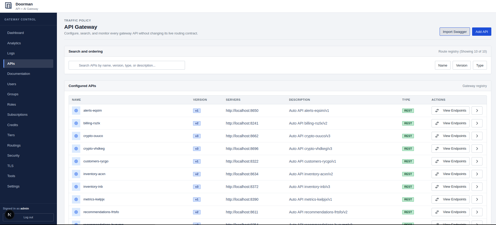

# Doorman API Gateway

A Rust API gateway and control plane for REST, SOAP, GraphQL, gRPC, gRPC-Web, and AI APIs.

Get started: [Quick Demo](#get-started-quick-demo), [Self-Hosting](#get-started-self-hosting), or [Let Us Manage For You!](https://app.doorman.dev/signup)

## Key features

- Multi-protocol gateway: REST, SOAP, GraphQL, native gRPC, and gRPC-Web
- Native control plane: authentication, users, APIs, endpoints, roles, groups, routing, subscriptions, credits, tiers, quotas, security, discovery, and monitoring
- Traffic policy: rate limits, throttling, bandwidth limits, routing, retries, circuit breaking, credits, and schema validation
- Dual storage: a self-contained in-memory mode or shared MongoDB and Redis
- Encrypted in-memory snapshots compatible with the former DMP1 dump format
- Next.js management UI served alongside the Rust service

## Control plane

The built-in control plane centralizes gateway configuration, access management, traffic controls, and operations in one self-hosted interface.



- **API lifecycle:** catalog and visual builder, protocol and endpoint configuration, schema validation, and API discovery.
- **Access and consumption:** authentication, users, roles, groups, subscriptions, credits, tiers, and quotas.
- **Traffic management:** routing, rate limits, throttling, bandwidth limits, retries, and circuit breaking.
- **Operations and security:** analytics, request logs, monitoring, audit and security controls, and configuration import/export.

## Get Started: Quick Demo

```bash
cp .env.demo .env
docker compose -f docker-compose.yml -f docker-compose.demo.yml up --build
```

- Web UI: [http://localhost:3000](http://localhost:3000)
- Gateway and platform API: [http://localhost:3001](http://localhost:3001)
- Admin: `demo@doorman.dev` / `DemoPassword123!`
- Storage: in memory; MongoDB and Redis are not required

## Get Started: Self-Hosting

Copy the template, then replace its deliberately invalid administrator credentials
and JWT secret before launching. The development defaults are configured for the
bundled HTTP dashboard at `http://localhost:3000`; set your TLS, CORS, issuer,
audience, and discovery values before switching to `ENV=production`.

```bash
cp .env.example .env
docker compose up -d --build
```

The default is `MEM_OR_EXTERNAL=MEM`. For a shared, multi-instance deployment:

```bash
MEM_OR_EXTERNAL=REDIS docker compose --profile external up -d --build
```

Shared mode uses MongoDB for durable configuration and Redis for caches, counters, revocations, routing state, and analytics.

### Configuration

| Variable | Required | Description |
| :--- | :--- | :--- |
| `DOORMAN_ADMIN_EMAIL` | Yes | Initial administrator email |
| `DOORMAN_ADMIN_PASSWORD` | Yes | Initial administrator password |
| `JWT_SECRET_KEY` or `JWT_KEYS` | Yes | Access-token signing configuration |
| `MEM_OR_EXTERNAL` | No | `MEM` (default) or `REDIS` for MongoDB plus Redis |
| `MEM_ENCRYPTION_KEY` | In memory mode | Encrypts automatic and manual DMP1 snapshots |
| `MEM_DUMP_PATH` | No | Snapshot path hint; defaults to `data/memory_dump.bin` |
| `NEXT_PUBLIC_GATEWAY_URL` | No | Browser gateway target; same-origin by default |

Public protocol URLs and platform API request/response contracts remain unchanged. There is no legacy-process proxy or fallback in the runtime image.

Unauthenticated self-registration is available at `/platform/authorization/register` and is protected by the configured registration IP rate limit.

## Repository structure

```text
doorman/
├── gateway-rs/             # Rust gateway and control plane
├── web-client/             # Next.js dashboard
├── parity/                 # Frozen pre-Rust public contract fixtures
├── user-docs/              # Guides and runbooks
├── scripts/                # Build and operational helpers
└── ops/                    # Infrastructure configuration
```

## Documentation

- [Getting Started](user-docs/01-getting-started.md)
- [Configuration](user-docs/02-configuration.md)
- [Security and Hardening](user-docs/03-security.md)
- [API Workflows](user-docs/04-api-workflows.md)
- [Production Operations](user-docs/05-operations.md)
- [Testing](user-docs/TESTS.md)

## License

Copyright © Doorman Dev, LLC. Licensed under the Apache License 2.0.
